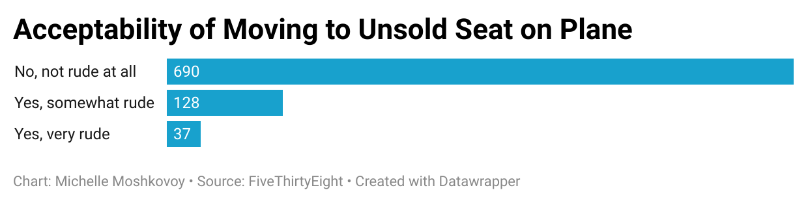

# Airplane Etiquette 
This is a repository centered around airplane etiquette, which will display the acceptability of taking an unsold plane seat among other passengers. 

This is a chart I made for the Week 4 Homework Quiz on Data Visualization. The data wrapper chart visualizes the acceptability of taking an unsold plane seat among other passengers. Specifically, the question asked was: is it rude to move to an unsold seat on a plane? I chose this question because I think different types of etiquette pervade our society, and it's interesting to see how others differ or align in their judgements -- in this case, when they're hovering above Earth. In regards to etiquette on an airplane, I think that respecting one's privacy is an important theme. Following that notion, 2/3 of respondents didn't find moving to an unsold seat rude. I believe the majority leaned that way because the principle of respecting others' privacy is still upheld. Taking or leaving the unsold seat doesn't heavily impact other passengers' assigned seating. However, there is that 1/3 of respondents who believe taking unsold seats is somewhat rude or very rude. I think the negative reactions boil down to the importance of following rules, meaning if a passenger already has assigned seating, they should follow it regardless of whether there is empty seats on the plane. ***Note: These are claims from the data, not inferences.***

